# 🔐 Security Policy

**Last Audit:** 10 February 2026  
**Status:** ✅ Secure — Full audit, Firebase rules updated for typing indicators

---

## Architecture Overview

```mermaid
graph LR
    Client["🖥️ Browser Client"] -->|Origin-guarded| API["⚡ Vercel API Routes"]
    API -->|process.env| Secrets["🔑 Server Secrets"]
    Client -->|VITE_ config| Firebase["🔥 Firebase RTDB"]
    API -->|Bearer token| PMS["🏨 PMS API"]
    API -->|API key| Gemini["🤖 Gemini AI"]
    Client -->|WebSocket| GeminiLive["🎙️ Gemini Live"]
```

---

## 1. API Key Management

| Secret | Storage | Client Exposure | Status |
|--------|---------|-----------------|--------|
| `GEMINI_API_KEY` | Server `process.env` | ❌ Never in bundle | ✅ Secure |
| `PMS_API_KEY` | Server `process.env` | ❌ Never in bundle | ✅ Secure |
| `PMS_API_URL` | Client `VITE_` prefix | ⚠️ URL in bundle | 🟢 Low risk — no auth value |
| `PMS_HOTEL_ID` | Client `VITE_` prefix | ⚠️ ID in bundle | 🟢 Low risk — metadata only |
| Firebase config | Client `VITE_FIREBASE_*` | ⚠️ In bundle | 🟢 Public by design |

### Firebase Config (Public by Design)

Firebase API keys are **project identifiers**, not secrets. They identify which Firebase project to connect to, but do not grant privileged access. Security is enforced via **Firebase Security Rules** (`database.rules.json`), not by hiding the config. This is [standard Firebase architecture](https://firebase.google.com/docs/projects/api-keys).

### Live Token Endpoint

`/api/live-token` returns the Gemini API key at runtime for WebSocket connections. Protected by:
- Origin validation (whitelisted domains only)
- GET-only method enforcement
- Key never baked into the JS bundle

### Source Code Audit (10 Feb 2026)

✅ **No hardcoded API keys** found in source code  
✅ **No API key patterns** (e.g. `AIza*`, `sk-*`) detected in any `.ts`, `.tsx`, `.js`, or `.json` files

---

## 2. API Route Protection

All 7 Vercel serverless functions in `/api/` implement consistent security via a **shared `withCors()` guard** from `_apiGuard.ts`:

| Route | Guard | Method | Input Validation |
|-------|-------|--------|------------------|
| `gemini-refine.ts` | ✅ `withCors()` | POST | `guests` array required |
| `gemini-analytics.ts` | ✅ `withCors()` | POST | `sessions` array required |
| `gemini-sentiment.ts` | ✅ `withCors()` | POST | `guests` array required |
| `gemini-cleaning-order.ts` | ✅ `withCors()` | POST | `guests` array required |
| `live-token.ts` | ✅ Inline guard | GET | N/A |
| `pms-proxy.ts` | ✅ `withCors()` | POST | `action` + `date` required |
| `_apiGuard.ts` | Shared guard module | — | — |

**Every route enforces (via shared guard):**
- **Origin validation** — only `.vercel.app`, `localhost`, and `127.0.0.1` accepted
- **Method guards** — rejects unexpected HTTP methods with 405
- **CORS preflight** — proper OPTIONS handling with 24h cache
- **Error boundaries** — structured error responses (400/403/405/500/502)

> **Note:** `live-token.ts` uses an inline origin guard duplicating `_apiGuard.ts` logic. This is intentional — Vercel bundles each API route independently, and the inline guard ensures the token endpoint is self-contained.

---

## 3. Content Security Policy

Defined in `vercel.json` with these headers on all routes:

| Header | Value |
|--------|-------|
| `Content-Security-Policy` | Restrictive `default-src 'self'` with explicit allowlists |
| `X-Content-Type-Options` | `nosniff` |
| `X-Frame-Options` | `DENY` |
| `Referrer-Policy` | `strict-origin-when-cross-origin` |

**CSP directive breakdown:**

| Directive | Allowed Sources | Rationale |
|-----------|----------------|-----------|
| `default-src` | `'self'` | Restrictive baseline |
| `script-src` | `'self'`, `'unsafe-inline'`, `'unsafe-eval'`, Google APIs, Firebase, Vercel, esm.sh, Tailwind CDN | Required by React/Vite SPA runtime |
| `style-src` | `'self'`, `'unsafe-inline'`, Google Fonts, Vercel | Inline styles + web fonts |
| `font-src` | `'self'`, Google Fonts (gstatic) | Typography |
| `img-src` | `'self'`, `data:`, `blob:`, `https:` | Broad image loading |
| `connect-src` | Firebase (HTTPS + WSS), Gemini, Vercel, Pusher, Open-Meteo | API + real-time connections |
| `worker-src` | `'self'`, `blob:`, esm.sh | Web workers |
| `frame-src` | `https://vercel.live` | Vercel toolbar only |
| `object-src` | `'none'` | Blocks Flash/Java plugins |
| `base-uri` | `'self'` | Prevents base tag injection |

### CSP Observations

- `unsafe-inline` / `unsafe-eval` in `script-src`: **required** by Vite's dev/HMR and React runtime. Cannot be removed without breaking the SPA.
- `img-src https:` is permissive — acceptable for a private hotel operations tool.

---

## 4. Firebase Security Rules

Defined in `database.rules.json`:

| Path | Read | Write | Validation |
|------|------|-------|------------|
| `sessions/$sessionId` | ✅ | ✅ | — |
| `presence/$sessionId` | ✅ | ✅ | — |
| `heartbeat/$sid/$deviceId` | ❌ | ✅ Write-only | — |
| `chat/$sid/$messageId` | ✅ | ✅ | `author`, `text`, `timestamp` required |
| `typing/$sessionId` | ✅ | ✅ | — |
| `$other` (catch-all) | ❌ | ❌ | Blocks all unknown paths |

> **Note:** Open read/write on sessions/presence/chat/typing is acceptable for this internal hotel operations tool. If external access is ever required, add Firebase Authentication.

### Recent Change (10 Feb 2026)
Added `typing/` path rules to support the new real-time typing indicator feature. Follows the same access pattern as `presence/` (session-scoped, ephemeral data).

---

## 5. XSS & Injection Prevention

| Vector | Status | Detail |
|--------|--------|--------|
| React auto-escaping | ✅ | All user data rendered via JSX |
| `dangerouslySetInnerHTML` | ✅ | **Not used** anywhere in codebase |
| `eval()` | ✅ | **Not used** in app source code |
| `innerHTML` assignment | ✅ | **Not used** in app source code |
| `document.cookie` | ✅ | **Not accessed** by app code |
| `window.open` / `postMessage` | ✅ | **Not used** in app code (only in `node_modules` type defs) |

### Source Code Verification (10 Feb 2026)

Grep audit confirmed zero instances of:
- `dangerouslySetInnerHTML`
- `eval(` or `Function(`
- `innerHTML =`
- `document.cookie`

in any `.ts` or `.tsx` source file.

---

## 6. Authentication Model

This is an **internal hotel operations tool**. Users identify themselves by name and department selection — no password required. This is intentional for the operational context: staff need quick, frictionless access during guest arrivals.

**If external access is ever needed**, upgrade to:
1. Firebase Authentication with email/password or SSO
2. Role-based access control mapped to departments
3. Firebase security rules tied to `auth.uid`

---

## 7. Data Handling

| Data Type | Storage | In Transit | At Rest |
|-----------|---------|------------|---------|
| Guest names & details | Firebase RTDB | TLS encrypted | Firebase managed |
| Chat messages | Firebase RTDB | TLS encrypted | Firebase managed |
| Typing indicators | Firebase RTDB | TLS encrypted | Ephemeral (auto-cleared) |
| Emoji reactions | Firebase RTDB | TLS encrypted | Firebase managed |
| User preferences | `localStorage` | N/A (client-only) | Unencrypted |
| Session cache | `localStorage` | N/A (client-only) | Unencrypted |
| Theme preference | `localStorage` | N/A (client-only) | Unencrypted |
| Notification prefs | `localStorage` | N/A (client-only) | Unencrypted |

**localStorage audit (10 Feb 2026):** Used in 4 source files:
- `firebaseService.ts` — session ID cache
- `UserProvider.tsx` — user name/department
- `ThemeProvider.tsx` — theme preference
- `useNotifications.ts` — notification settings

✅ **No passwords, tokens, or payment data** stored in `localStorage`  
✅ Session deletion clears Firebase (`sessions/`, `presence/`, `chat/`, `typing/`) AND `localStorage`

---

## 8. Dependency Security

Last `npm audit` (10 Feb 2026): **4 vulnerabilities** (1 moderate, 3 high)

| Package | Source | Severity | Exploitable? |
|---------|--------|----------|--------------|
| `path-to-regexp` (via `@vercel/node`) | Transitive | High | ❌ Server-side route matching, no user-controlled patterns |
| `undici` (via `@vercel/node`) | Transitive | Moderate | ❌ Server-side HTTP, behind Vercel's infrastructure |
| `xlsx` (SheetJS) | Transitive | High | ❌ Server-processed only, no untrusted file uploads |

All are transitive dependencies with no direct fix available. None are exploitable in this application's context.

---

## 9. Environment & Deployment

| Check | Status | Detail |
|-------|--------|--------|
| `.env` excluded from Git | ✅ | `.gitignore` includes `.env`, `.env.local`, `.env.*.local` |
| Server-side env vars | ✅ | Configured in Vercel dashboard |
| Production builds | ✅ | `vite build` with tree-shaking |
| Source maps | ✅ | Not deployed to production |
| HTTPS enforcement | ✅ | Vercel enforces HTTPS on all routes |
| `X-Frame-Options: DENY` | ✅ | Prevents clickjacking |
| `nosniff` header | ✅ | Prevents MIME type sniffing |
| `Referrer-Policy` | ✅ | `strict-origin-when-cross-origin` |

---

## 10. Voice Assistant Security

The Gemini Live voice assistant uses WebSocket connections that require HTTPS:

| Concern | Mitigation |
|---------|------------|
| API key exposure | Fetched at runtime via `/api/live-token` (origin-guarded) |
| Audio recording | Browser-level permission required (microphone) |
| Data transmission | WSS (WebSocket Secure) to `generativelanguage.googleapis.com` |
| User consent | Explicit "Start" action required — never auto-records |

---

## Reporting

If you discover a security issue, please contact the repository owner directly.
