# 🔐 Security Policy

**Last Audit:** 8 February 2026  
**Status:** ✅ Secure — No critical vulnerabilities

---

## Architecture Overview

```mermaid
graph LR
    Client["🖥️ Browser Client"] -->|Origin-guarded| API["⚡ Vercel API Routes"]
    API -->|process.env| Secrets["🔑 Server Secrets"]
    Client -->|VITE_ config| Firebase["🔥 Firebase RTDB"]
    API -->|Bearer token| PMS["🏨 PMS API"]
    API -->|API key| Gemini["🤖 Gemini AI"]
```

---

## 1. API Key Management

| Secret | Storage | Client Exposure | Status |
|--------|---------|-----------------|--------|
| `GEMINI_API_KEY` | Server `process.env` | ❌ Never in bundle | ✅ Secure |
| `PMS_API_KEY` | Server `process.env` | ❌ Never in bundle | ✅ Secure |
| `PMS_API_URL` | Client `VITE_` prefix | ⚠️ URL in bundle | 🟢 Low risk — no auth value |
| `PMS_HOTEL_ID` | Client `VITE_` prefix | ⚠️ ID in bundle | 🟢 Low risk — metadata only |
| Firebase config | Client `VITE_FIREBASE_*` | ⚠️ In bundle | 🟢 Public by design |

### Firebase Config (Public by Design)

Firebase API keys are **project identifiers**, not secrets. They identify which Firebase project to connect to, but do not grant privileged access. Security is enforced via **Firebase Security Rules** (`database.rules.json`), not by hiding the config. This is [standard Firebase architecture](https://firebase.google.com/docs/projects/api-keys).

### Live Token Endpoint

`/api/live-token` returns the Gemini API key at runtime for WebSocket connections. Protected by:
- Origin validation (whitelisted domains only)
- GET-only method enforcement
- Key never baked into the JS bundle

---

## 2. API Route Protection

All 7 Vercel serverless functions in `/api/` implement consistent security:

| Route | Guard | Method | Input Validation |
|-------|-------|--------|------------------|
| `gemini-refine.ts` | ✅ Origin | POST | `guests` array required |
| `gemini-analytics.ts` | ✅ Origin | POST | `sessions` array required |
| `gemini-sentiment.ts` | ✅ Origin | POST | `guests` array required |
| `gemini-cleaning-order.ts` | ✅ Origin | POST | `guests` array required |
| `live-token.ts` | ✅ Origin | GET | N/A |
| `pms-proxy.ts` | ✅ Origin | POST | `action` + `date` required |
| `_apiGuard.ts` | Shared guard module | — | — |

**Every route enforces:**
- **Origin validation** — only `.vercel.app`, `localhost`, and `127.0.0.1` accepted
- **Method guards** — rejects unexpected HTTP methods with 405
- **CORS preflight** — proper OPTIONS handling with 24h cache
- **Error boundaries** — structured error responses (400/403/405/500/502)

---

## 3. Content Security Policy

Defined in `vercel.json` with these headers on all routes:

| Header | Value |
|--------|-------|
| `Content-Security-Policy` | Restrictive `default-src 'self'` with explicit allowlists |
| `X-Content-Type-Options` | `nosniff` |
| `X-Frame-Options` | `DENY` |
| `Referrer-Policy` | `strict-origin-when-cross-origin` |

**CSP highlights:**
- `frame-src: 'none'` — blocks iframe embedding
- `object-src: 'none'` — blocks Flash/Java plugins
- `base-uri: 'self'` — prevents base tag injection
- `connect-src` — explicit allowlist for Firebase, Gemini, Vercel
- `script-src` includes `unsafe-inline` / `unsafe-eval` (required by React/Vite SPA)

---

## 4. Firebase Security Rules

Defined in `database.rules.json`:

| Path | Read | Write | Validation |
|------|------|-------|------------|
| `sessions/$sessionId` | ✅ | ✅ | — |
| `presence/$sessionId` | ✅ | ✅ | — |
| `heartbeat/$sid/$deviceId` | ❌ | ✅ Write-only | — |
| `chat/$sid/$messageId` | ✅ | ✅ | `author`, `text`, `timestamp` required |
| `$other` (catch-all) | ❌ | ❌ | Blocks all unknown paths |

> **Note:** Open read/write on sessions/presence/chat is acceptable for this internal hotel operations tool. If external access is ever required, add Firebase Authentication.

---

## 5. XSS & Injection Prevention

- **React auto-escaping** — all user data rendered via JSX (never raw HTML)
- **`dangerouslySetInnerHTML`** — used only for static CSS strings (no user input)
- **`GuestRow.tsx`** — explicitly renders React elements instead of injecting HTML
- **No `eval()` of user input** anywhere in the codebase

---

## 6. Authentication Model

This is an **internal hotel operations tool**. Users identify themselves by name and department selection — no password required. This is intentional for the operational context: staff need quick, frictionless access during guest arrivals.

**If external access is ever needed**, upgrade to:
1. Firebase Authentication with email/password or SSO
2. Role-based access control mapped to departments
3. Firebase security rules tied to `auth.uid`

---

## 7. Data Handling

| Data Type | Storage | In Transit | At Rest |
|-----------|---------|------------|---------|
| Guest names & details | Firebase RTDB | TLS encrypted | Firebase managed |
| Chat messages | Firebase RTDB | TLS encrypted | Firebase managed |
| User preferences | `localStorage` | N/A (client-only) | Unencrypted |
| Session cache | `localStorage` | N/A (client-only) | Unencrypted |

- **No passwords or payment data** are stored
- Session deletion clears Firebase (`sessions/`, `presence/`, `chat/`) AND `localStorage`
- `localStorage` contains only operational data, cleared on logout

---

## 8. Dependency Security

Last `npm audit` (8 Feb 2026): **4 vulnerabilities** (1 moderate, 3 high)

| Package | Type | Severity | Exploitable? |
|---------|------|----------|--------------|
| `xlsx` (SheetJS) | Transitive | Moderate | ❌ Server-processed only |
| `undici` (via `@vercel/node`) | Transitive | High ×3 | ❌ Server-side, behind Vercel |

Both are transitive dependencies with no direct fix available. Neither is exploitable in this application's context.

---

## 9. Environment & Deployment

- `.env` files excluded via `.gitignore` ✅
- Vercel environment variables configured server-side ✅
- Production builds via `vite build` with tree-shaking ✅
- No source maps deployed to production ✅

---

## Reporting

If you discover a security issue, please contact the repository owner directly.
